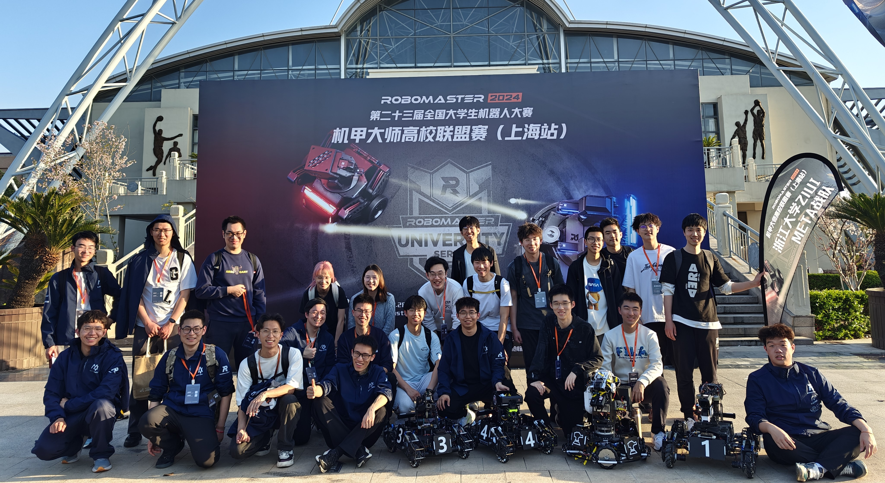

<div align="center">
  
  <figcaption> RoboMaster Competition at Shanghai 2024.3.30 17:12</figcaption>
</div>

## Education  
- 2024-now M.S. in Mechanical Engineering (Automation and Systems) at EPFL
  - 2025.07-2025.12 Exchange to ETH for quadruped Robot Research at [CRL](https://crl.ethz.ch/) (Computational Robotics Lab)
- 2020-2024 B.S. in Mechanical Engineering at Zhejiang University (ZJU)
- 2020-2024 ZJUI META RoboMaster Team Mechanical Group member


<!-- 小蛇 -->
<!--
<picture>
  <source media="(prefers-color-scheme: dark)" srcset="https://raw.githubusercontent.com/MATH-286-Pro/MATH-286-Pro/output/github-contribution-grid-snake-dark.svg">
  <source media="(prefers-color-scheme: light)" srcset="https://raw.githubusercontent.com/MATH-286-Pro/MATH-286-Pro/output/github-contribution-grid-snake.svg">
  
</picture>
-->

## Projects
- [Legged Robot](https://github.com/MATH-286-Pro/EPFL-MICRO-507-Legged-Robot-Project-2)
- [Wheel-legged Robot](https://github.com/MATH-286-Pro/ZJUI-Balance-Infantry-Ver-1.0)

## Skills
- Robotics: ROS2, STM32, openCV, Isaac Lab, Docker
- Coding: Python, C, MATLAB, git
- Design: Fusion360, Solidworks, 3D Print

## Coding

<!--START_SECTION:waka-->

```rust
From: 09 October 2024 - To: 20 September 2025

Total Time: 916 hrs 14 mins

Python                             655 hrs 7 mins  >>>>>>>>>>>>>>>>>>-------   71.37 %
Markdown                           112 hrs 24 mins >>>----------------------   12.25 %
Bash                               37 hrs 31 mins  >------------------------   04.09 %
Git                                14 hrs 5 mins   -------------------------   01.54 %
C++                                14 hrs          -------------------------   01.53 %
Text                               9 hrs 22 mins   -------------------------   01.02 %
C                                  8 hrs 13 mins   -------------------------   00.90 %
XML                                6 hrs 57 mins   -------------------------   00.76 %
```

<!--END_SECTION:waka-->
