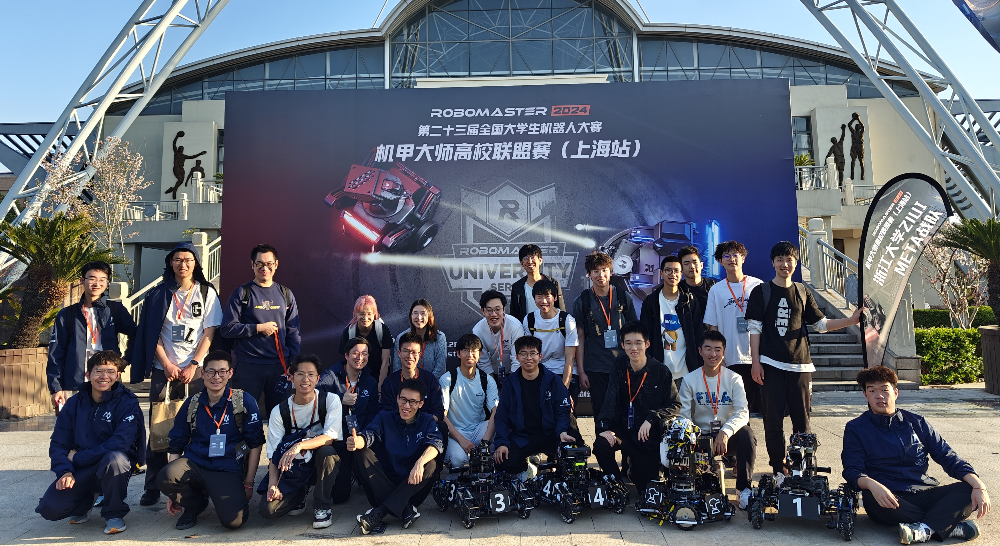

<div align="center">
  
  <figcaption> RoboMaster Competition at Shanghai 2024.3.30 17:12</figcaption>
</div>

## Education  
- 2025.07-now Exchange to ETH for quadruped Robot Research at [CRL](https://crl.ethz.ch/) (Computational Robotics Lab)
- 2024-now M.S. in Mechanical Engineering (Automation and Systems) at EPFL
- 2020-2024 B.S. in Mechanical Engineering at Zhejiang University (ZJU)
- 2020-2024 ZJUI META RoboMaster Team Mechanical Group member


<!-- 小蛇 -->
<!--
<picture>
  <source media="(prefers-color-scheme: dark)" srcset="https://raw.githubusercontent.com/MATH-286-Pro/MATH-286-Pro/output/github-contribution-grid-snake-dark.svg">
  <source media="(prefers-color-scheme: light)" srcset="https://raw.githubusercontent.com/MATH-286-Pro/MATH-286-Pro/output/github-contribution-grid-snake.svg">
  
</picture>
-->

## Projects
- [Legged Robot](https://github.com/MATH-286-Pro/EPFL-MICRO-507-Legged-Robot-Project-2)
- [Wheel-legged Robot](https://github.com/MATH-286-Pro/ZJUI-Balance-Infantry-Ver-1.0)

## Skills
- Robotics: IsaacLab, ROS2, STM32, openCV, Docker
- Coding: Python, C, MATLAB, git
- Design: Fusion360, Solidworks, 3D Print

## Coding

<!--START_SECTION:waka-->

```rust
From: 09 October 2024 - To: 07 March 2026

Total Time: 1,610 hrs 38 mins

Python                             1,186 hrs 28 mins     >>>>>>>>>>>>>>>>>>-------   73.48 %
Markdown                           122 hrs 51 mins       >>-----------------------   07.61 %
Bash                               66 hrs 13 mins        >------------------------   04.10 %
Git                                28 hrs 58 mins        -------------------------   01.79 %
C++                                14 hrs 1 min          -------------------------   00.87 %
Text                               11 hrs 55 mins        -------------------------   00.74 %
C                                  8 hrs 13 mins         -------------------------   00.51 %
XML                                7 hrs 15 mins         -------------------------   00.45 %
```

<!--END_SECTION:waka-->
