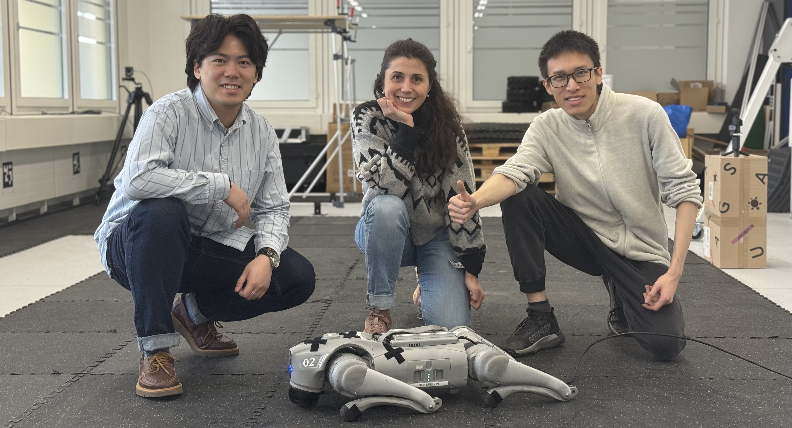

<div align="center">
  
  <figcaption> Project Photo at CRL 2026.03.20</figcaption>
</div>

<div align="center">
  
  <figcaption> RoboMaster Competition at Shanghai 2024.3.30 17:12</figcaption>
</div>

## Education  
- 2024-now M.S. in Mechanical Engineering (Automation and Systems) at EPFL
  - 2026.03 - now Researching whole-body-control project at ETH [PBL](https://pbl.ee.ethz.ch/)
  - 2025.07 - 2026.03 Researching behavior foundation model for quadruped Robot at ETH [CRL](https://crl.ethz.ch/)
- 2020-2024 B.S. in Mechanical Engineering at Zhejiang University (ZJU)
- 2020-2024 ZJUI META RoboMaster Team Mechanical Group member


<!-- 小蛇 -->
<!--
<picture>
  <source media="(prefers-color-scheme: dark)" srcset="https://raw.githubusercontent.com/MATH-286-Pro/MATH-286-Pro/output/github-contribution-grid-snake-dark.svg">
  <source media="(prefers-color-scheme: light)" srcset="https://raw.githubusercontent.com/MATH-286-Pro/MATH-286-Pro/output/github-contribution-grid-snake.svg">
  
</picture>
-->

## Projects
- [Zero Shot Forward Backward RL on Quadruped Robot](https://github.com/MATH-286-Pro/FB-MEBE)
- [Legged Robot](https://github.com/MATH-286-Pro/EPFL-MICRO-507-Legged-Robot-Project-2)
- [Wheel-legged Robot](https://github.com/MATH-286-Pro/ZJUI-Balance-Infantry-Ver-1.0)

## Skills
- Robotics: IsaacLab, ROS2, STM32, openCV, Docker
- Coding: Python, C, MATLAB, git
- Design: Fusion360, Solidworks, 3D Print

## Coding

<!--START_SECTION:waka-->

```rust
From: 09 October 2024 - To: 26 April 2026

Total Time: 1,743 hrs 13 mins

Python                             1,277 hrs 26 mins     >>>>>>>>>>>>>>>>>>-------   72.89 %
Markdown                           129 hrs 2 mins        >>-----------------------   07.36 %
Bash                               71 hrs 54 mins        >------------------------   04.10 %
Git                                33 hrs 45 mins        -------------------------   01.93 %
XML                                14 hrs 11 mins        -------------------------   00.81 %
C++                                14 hrs 1 min          -------------------------   00.80 %
Text                               11 hrs 56 mins        -------------------------   00.68 %
Other                              9 hrs 18 mins         -------------------------   00.53 %
```

<!--END_SECTION:waka-->
