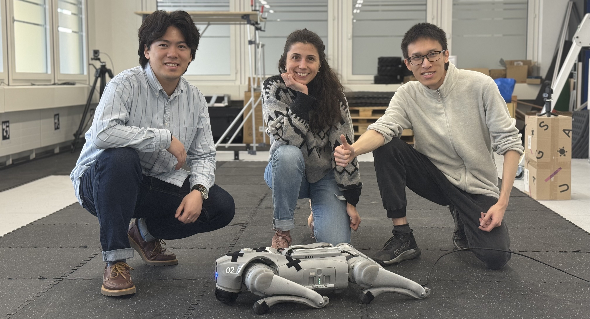
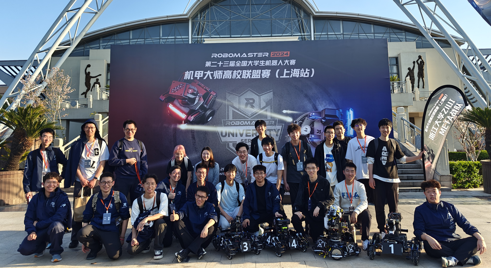

<div align="center">
  
  <figcaption> Project Photo at CRL 2026.03.20</figcaption>
</div>

<div align="center">
  
  <figcaption> RoboMaster Competition at Shanghai 2024.3.30 17:12</figcaption>
</div>

## Education  
- 2024-now M.S. in Mechanical Engineering (Automation and Systems) at EPFL
  - 2026.03 - 2026.07 Researching whole-body-control project at ETH [PBL](https://pbl.ee.ethz.ch/)
  - 2025.07 - 2026.03 Researching behavior foundation model for quadruped Robot at ETH [CRL](https://crl.ethz.ch/)
- 2020-2024 B.S. in Mechanical Engineering at Zhejiang University (ZJU)
- 2020-2024 ZJUI META RoboMaster Team Mechanical Group member


<!-- 小蛇 -->
<!--
<picture>
  <source media="(prefers-color-scheme: dark)" srcset="https://raw.githubusercontent.com/MATH-286-Pro/MATH-286-Pro/output/github-contribution-grid-snake-dark.svg">
  <source media="(prefers-color-scheme: light)" srcset="https://raw.githubusercontent.com/MATH-286-Pro/MATH-286-Pro/output/github-contribution-grid-snake.svg">
  
</picture>
-->

## Projects
- [Zero Shot Forward Backward RL on Quadruped Robot](https://github.com/MATH-286-Pro/FB-MEBE)
- [Legged Robot](https://github.com/MATH-286-Pro/EPFL-MICRO-507-Legged-Robot-Project-2)
- [Wheel-legged Robot](https://github.com/MATH-286-Pro/ZJUI-Balance-Infantry-Ver-1.0)

## Skills
- Robotics: IsaacLab, ROS2, STM32, openCV, Docker
- Coding: Python, C, MATLAB, git
- Design: Fusion360, Solidworks, 3D Print

## Coding

<!--START_SECTION:waka-->

```rust
From: 09 October 2024 - To: 25 August 2026

Total Time: 2,267 hrs 26 mins

Python                             1,608 hrs 42 mins     >>>>>>>>>>>>>>>>>>-------   70.34 %
Markdown                           156 hrs 37 mins       >>-----------------------   06.85 %
Bash                               113 hrs 2 mins        >------------------------   04.94 %
Git                                50 hrs 1 min          >------------------------   02.19 %
XML                                46 hrs 49 mins        >------------------------   02.05 %
CSV                                27 hrs 37 mins        -------------------------   01.21 %
Other                              19 hrs 37 mins        -------------------------   00.86 %
```

<!--END_SECTION:waka-->
